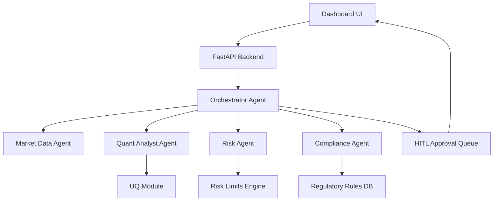
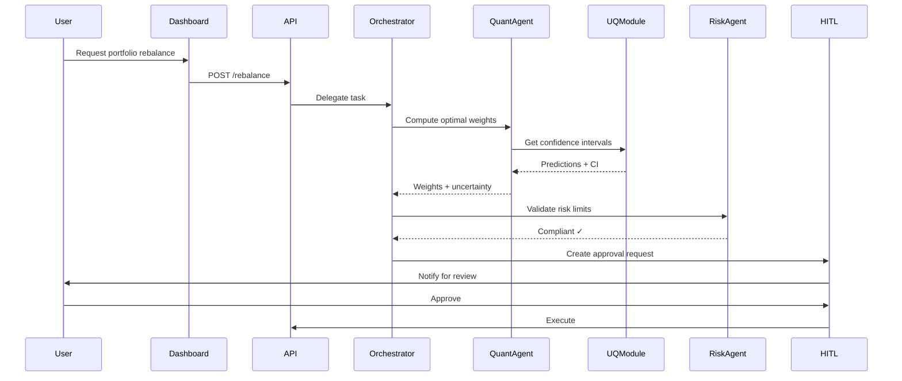

---
name: pr-asset-creation
description: Create professional pull requests, documentation, changelogs, release notes, diagrams, and presentation assets for financial AI projects. Triggers on requests about PR descriptions, release notes, architecture diagrams, slide decks, README files, technical documentation, or stakeholder presentations.
---

# pr-asset-creation

You have the `pr-asset-creation` skill. Use it when the user needs to create pull requests, documentation, diagrams, or presentation materials.

## Pull Request Creation

### PR Template for AI-Finance Projects

```markdown
## Summary
<!-- What does this PR do? Why is it needed? -->

## Type of Change
- [ ] 🐛 Bug fix
- [ ] ✨ New feature
- [ ] 🔧 Refactoring
- [ ] 📊 Model update
- [ ] 📋 Compliance/regulatory
- [ ] 📚 Documentation

## Changes Made
### Files Changed
- `path/to/file.py` — Description of change
- `path/to/other.py` — Description of change

### Model/Algorithm Changes
- Previous: [describe old approach]
- New: [describe new approach]
- Performance delta: Sharpe +0.12, Max DD -2.1%

## Testing
- [ ] Unit tests added/updated
- [ ] Backtest results validated
- [ ] Compliance rules checked
- [ ] UQ metrics within acceptable bounds

## Risk Assessment
| Risk | Likelihood | Impact | Mitigation |
|------|-----------|--------|------------|
| Model degradation | Low | High | A/B shadow testing |
| Compliance breach | Very Low | Critical | Automated rule validation |

## Backtest Results
| Metric | Before | After | Change |
|--------|--------|-------|--------|
| Sharpe Ratio | 1.23 | 1.35 | +9.8% |
| Max Drawdown | -14.2% | -12.1% | +2.1% |
| Annual Return | 18.3% | 21.7% | +3.4% |

## Screenshots / Artifacts
<!-- Attach relevant charts, dashboards, or diagrams -->

## Compliance Sign-off
- [ ] Business logic changes reviewed by compliance
- [ ] Audit trail updated
- [ ] Regulatory mapping documented

## Reviewer Checklist
- [ ] Code quality and style
- [ ] No lookahead bias
- [ ] Risk limits respected
- [ ] Documentation updated
```

## Changelog & Release Notes

### Format: Keep a Changelog (keepachangelog.com)

```markdown
# Changelog

## [2.1.0] - 2026-06-21

### Added
- Uncertainty quantification for all portfolio predictions
- Human-in-the-loop approval workflow for trades > $1M
- AML transaction monitoring with ML anomaly detection

### Changed
- Portfolio optimizer now uses Black-Litterman instead of MV
- Risk limit checks now run pre-trade (previously post-trade)

### Fixed
- Sharpe ratio calculation now correctly annualizes daily returns
- Removed lookahead bias in momentum signal computation

### Security
- All model outputs now include provenance hash for audit

## [2.0.0] - 2026-05-15
...
```

## Architecture Diagrams

### Mermaid Diagram Templates

#### System Architecture


#### Data Flow


## README Template

```markdown
# AI-Finance: [Component Name]

> Brief one-liner description

## Overview
What this does, why it exists, who uses it.

## Quick Start
```bash
pip install -r requirements.txt
uvicorn main:app --reload
```

## Architecture
[Link to architecture diagram]

## Configuration
| Variable | Description | Default |
|----------|-------------|---------|
| `MODEL_VERSION` | Active model version | `latest` |
| `RISK_LIMIT_VAR` | Daily VaR limit | `0.02` |

## API Reference
[Link to API docs]

## Compliance & Regulatory Notes
[Link to regulatory mapping]

## Contributing
See [CONTRIBUTING.md]
```

## Presentation Assets

### Stakeholder Slide Structure
1. **Executive Summary** — 1 slide, business impact
2. **Problem Statement** — What we're solving
3. **Solution Architecture** — High-level diagram
4. **Key Results** — Performance metrics with before/after
5. **Risk & Compliance** — How we stay compliant
6. **Roadmap** — What's next
7. **Appendix** — Technical details on demand

### Data Visualization Best Practices
- Always label axes with units
- Show confidence intervals on all forecasts
- Use consistent color coding (green=profit, red=loss, amber=warning)
- Include data source and as-of date on every chart

## Verification Checklist

- [ ] PR description explains the "why", not just the "what"
- [ ] All metrics have before/after comparison
- [ ] Compliance implications documented
- [ ] Architecture diagrams are up to date
- [ ] Changelog entry added
- [ ] README reflects current state
